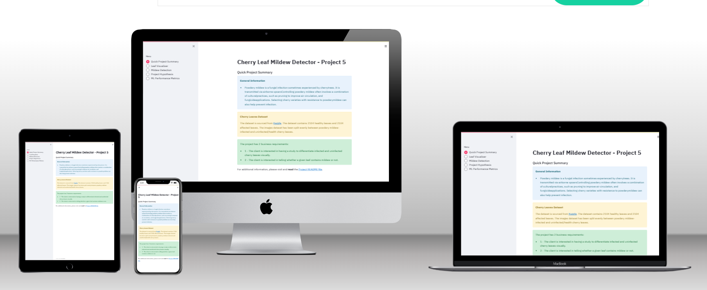

# The Cherry Leaf Mildew Detector

## Code Institute Project 5

The Mildew Detector is a machine learning model designed to identify and classify cherry leaves based on their health status, specifically distinguishing between leaves infected with powdery mildew and those that are healthy. The development of this detector follows a systematic approach, incorporating various stages from data collection to model evaluation.

# About the project

## 1. Data Collection

- The dataset comprises images of cherry leaves collected from Farmy & Foods' cherry tree crops.
- Two classes exist: healthy leaves and leaves infected with powdery mildew.
- The dataset underwent augmentation to ensure sufficient image diversity for robust model training.

## 2. Model Architecture

- The machine learning model is built using a Convolutional Neural Network (CNN).
- The CNN architecture includes convolutional layers, max-pooling layers, and dense layers, suitable for image classification tasks.

## 3. Training and Evaluation

- The model was trained on the augmented dataset, with an emphasis on achieving a high level of accuracy.
- Training involved optimizing the model using the Adam optimizer and binary cross-entropy loss function.
- Early stopping was implemented to prevent overfitting during the training process.

## 4. Model Performance

- The model's performance was evaluated using a separate test set.
- Evaluation metrics, including loss and accuracy, were monitored to ensure the model met the desired criteria.

## 5. Dashboard Interface

- Next steps involve fulfilling the business requirement for a dashboard interface.
- The interface will provide a user-friendly platform for uploading images, making predictions, and visualizing model outputs.

## 6. Conclusion

- The Mildew Detector successfully aligns with the business objective of providing a swift and reliable diagnostic tool for detecting powdery mildew in cherry trees.
- The model and its evaluation are saved for future use, and the project is poised to move into the dashboard development phase.

The Mildew Detector addresses the practical need for an automated and efficient solution in agriculture, enhancing the diagnosis of plant diseases and contributing to effective crop management.

# Dataset Content

- The dataset is sourced from [Kaggle](https://www.kaggle.com/codeinstitute/cherry-leaves). We then created a fictitious user story where predictive analytics can be applied in a real project in the workplace.
- The dataset contains +4 thousand images taken from the client's crop fields. The images show healthy cherry leaves and cherry leaves that have powdery mildew, a fungal disease that affects many plant species. The cherry plantation crop is one of the finest products in their portfolio, and the company is concerned about supplying the market with a compromised quality product.

# Business Requirements

The cherry plantation crop from Farmy & Foods is facing a challenge where their cherry plantations have been presenting powdery mildew. Currently, the process is manual verification if a given cherry tree contains powdery mildew. An employee spends around 30 minutes in each tree, taking a few samples of tree leaves and verifying visually if the leaf tree is healthy or has powdery mildew. If there is powdery mildew, the employee applies a specific compound to kill the fungus. The time spent applying this compound is 1 minute. The company has thousands of cherry trees, located on multiple farms across the country. As a result, this manual process is not scalable due to the time spent in the manual process inspection.

To save time in this process, the IT team suggested an ML system that detects instantly, using a leaf tree image, if it is healthy or has powdery mildew. A similar manual process is in place for other crops for detecting pests, and if this initiative is successful, there is a realistic chance to replicate this project for all other crops. The dataset is a collection of cherry leaf images provided by Farmy & Foods, taken from their crops.

- 1 - The client is interested in conducting a study to visually differentiate a healthy cherry leaf from one with powdery mildew.
- 2 - The client is interested in predicting if a cherry leaf is healthy or contains powdery mildew.

# Hypothesis

We hypothesize that cherry leaves infected with powdery mildew exhibit noticeable visual contrasts when compared to healthy leaves. This distinction can potentially be captured through image analysis, allowing for the development of an effective machine learning model.

## How to Validate

To validate our hypothesis, we propose conducting an average image study using the dataset provided by Farmy & Foods. This study will involve a comprehensive analysis of cherry leaf images, aiming to identify distinctive visual patterns associated with powdery mildew infection. The outcome of this study will guide the development and training of a machine learning system capable of instantaneously detecting the presence of powdery mildew in cherry leaves. The success of the model will be measured against its accuracy in distinguishing between healthy and infected leaves, with the ultimate goal of streamlining the current manual verification process and providing a scalable solution for Farmy & Foods.

## The Rationale to Map Business Requirements to Data Visualizations and ML Tasks

### Business Requirements

#### Data Visualization

1. **Display "mean" and "standard deviation" images:**

   - **Rationale:** Provides a visual representation of the statistical measures for both mildewed and healthy cherry leaves, aiding in understanding the variation in pixel values and patterns.

2. **Display the difference between average mildewed and uninfected leaves:**

   - **Rationale:** Offers a visual comparison, allowing for a clear distinction between the characteristics of mildewed and healthy leaves, aiding in the identification of key features.

3. **Display an image montage for mildewed or uninfected leaves:**
   - **Rationale:** Creates a comprehensive visual overview, facilitating easy differentiation between mildewed and healthy cherry leaves in a montage format.

#### Classification

4. **Predict if a leaf is infected with powdery mildew:**

   - **Rationale:** Enables quick identification of infected leaves, contributing to efficient decision-making in cherry tree crop management.

5. **Build a binary classifier and generate reports:**
   - **Rationale:** Provides a structured approach to classification, with the added benefit of generating detailed reports for analysis and documentation.

### Data Visualization Tasks

- **Mean and Standard Deviation Visualization:**

  - **Objective:** Showcase statistical values for healthy and mildewed cherry leaf images.
  - **Benefit:** Enables clients to visually distinguish between the two types of leaves based on statistical measures.

- **Comparison Visualization:**

  - **Objective:** Illustrate distinctions between a typical healthy cherry leaf and one infected by powdery mildew.
  - **Benefit:** Provides a clear visual reference for differentiation, aiding in identification of key visual features.

- **Montage Visualization:**
  - **Objective:** Create a visual montage featuring both healthy and infected cherry leaves.
  - **Benefit:** Facilitates an overall understanding by presenting a comprehensive visual summary of the different leaf conditions.

### ML Classification Tasks

- **Prediction Capability:**

  - **Objective:** Develop a model to predict whether a given leaf is healthy or infected.
  - **Benefit:** Offers clients a quick and automated method for leaf classification.

- **Machine Learning Model App:**
  - **Objective:** Provide clients with an intuitive application for predicting leaf health.
  - **Benefit:** Enhances user experience by simplifying the prediction process through a user-friendly application.

By aligning these data visualization and machine learning tasks with the identified business requirements, we aim to deliver a solution that not only meets but exceeds the expectations of the client, providing valuable insights and efficient decision-making tools for managing cherry tree crops effectively.

## ML Business Case

### Overview:

- Development of MildewCherryLeavesCLF, a binary classification model.
- Goal: Predict presence of powdery mildew on cherry leaves.
- Revolutionize diagnostic process for Farmy & Foods' cherry tree crops.

### Objectives:

1. **Accuracy Target:**

   - Achieve 95% accuracy or above on the model's test set.

2. **Diagnostic Enhancement:**
   - Provide a faster and more reliable diagnostic tool.
   - Eliminate labor-intensive manual inspections (currently 30 minutes per tree).

### Model Details:

- **Model Type:**

  - Supervised, 2-class, single-label classification model.

- **Output:**

  - Binary flag: Infected or not.
  - Probability of infection.

- **Workflow:**
  - Botanical staff conduct visual inspections and upload leaf images to the app.
  - On-the-fly predictions enable real-time decision-making.

### Training Data:

- **Source:**

  - Subset of 2208 images from provided dataset.

- **Features:**

  - All images serve as features.

- **Target:**
  - Binary classification: Infected or not.

### Rationale:

- **Current Challenges:**
  - Manual inspection is time-consuming.
  - Prone to human error.
  - Specific facilities lack staff and expertise for effective fungal detection.

### Conclusion:

- MildewCherryLeavesCLF aims to enhance efficiency and accuracy in diagnosing powdery mildew. Streamlining diagnostics for Farmy & Foods and paving the way for scalable solutions across diverse crops.

# Dashboard Design

I designed a comprehensive dashboard app using Streamlit to showcase various aspects of the project, including its hypothesis, summary, visualizer, detector, and machine learning model performance. The dashboard features a simple and user-friendly interface with a sidebar containing checkboxes for easy navigation to different pages within the application.

The project pages are structured as follows:

## Page 1: Quick Project Summary

**Summary**

Powdery mildew, caused by Podosphaera clandestina, impacts cherry trees, resulting in white powdery spots on leaves and stems, especially lower leaves. Flourishing in high humidity and moderate temperatures, it poses a threat to plants, causing significant damage and reducing harvest yields. The project addresses two business requirements:

1. The client seeks a study to visually differentiate between a healthy cherry leaf and one with powdery mildew.
2. The client is interested in predicting whether a cherry leaf is healthy or contains powdery mildew.

## Page 2: Leaf Visualizer

**Business requirement 1:**

The client aims to visually differentiate between a healthy cherry leaf and one with powdery mildew. Three functions are provided with checkboxes:

1. **Difference between average and variability image:**

   - Displays info text along with average and variability images.

2. **Differences between average powdery mildew and average healthy leaves:**

   - Shows info text along with average powdery and healthy leaf images.

3. **Image Montage:**
   - A drop-down menu for labels (healthy and powdery).
   - A button to create an image montage with one of the labels.

## Page 3: Mildew Detection

**Business requirement 2:**

The client seeks to visually differentiate if a given leaf contains mildew or not. Users can upload an image to validate its health status. The interface promptly displays the uploaded image along with a statement predicting the leaf's health status, providing a probability prediction and an analysis report available for download via a link labeled 'Download Report.'

## Page 4: Project Hypothesis and Validation

The page outlines the project's hypothesis, emphasizing that leaves infected by powdery mildew exhibit distinct visible markings. A trained machine learning model, with an accuracy of 95%, validates this distinction by comparing healthy and powdery mildew-infected cherry leaves.

## Page 5: ML Performance Metrics

A bar plot visualizes the distribution of two labels across three sets: Train, Validation, and Test. The dataset contains 2104 healthy leaves and 2104 infected leaves, split into training, validation, and test sets. Model history graphs, including training accuracy and losses, showcase the general performance on the test set.

# Bugs

1. I addressed a bug related to the PIL image attribute, switching from ANTIALIAS to LANCZOS in the resize_input_image function in the predictive_analysis.py file due to the removal of ANTIALIAS in the latest version of Pillow.
2. Additionally, I manually adjusted the stack from -22 to -20 before deploying to Heroku to support the correct Python version.
3. Removed and structured errors and typos.

## Unfixed Bugs

None.

## Deployment

### Heroku

- The App live link is: <https://code-project-5-85f1703f62ff.herokuapp.com/>
- Set the runtime.txt Python version to a [Heroku-20](https://devcenter.heroku.com/articles/python-support#supported-runtimes) stack currently supported version.
- The project was deployed to Heroku using the following steps.

1. Log in to Heroku and create an App
2. At the Deploy tab, select GitHub as the deployment method.
3. Select your repository name and click Search. Once it is found, click Connect.
4. Select the branch you want to deploy, then click Deploy Branch.
5. The deployment process should happen smoothly if all deployment files are fully functional. Click now the button Open App on the top of the page to access your App.
6. If the slug size is too large then add large files not required for the app to the .slugignore file.

### Languages

Python

### Frameworks and Other Technologies

- **Git:**

  - A distributed version control system that tracks changes in source code during software development.

- **GitHub:**

  - A web-based platform for version control using Git, facilitating collaborative software development and hosting repositories.

- **Heroku:**

  - A cloud platform that enables developers to deploy, manage, and scale applications effortlessly.

- **CodeAnywhere:**

  - An online development environment that allows coding from anywhere, offering collaboration features and support for multiple programming languages.

- **Jupyter:**
  - An open-source web application that allows the creation and sharing of live code, equations, visualizations, and narrative text in a single, interactive document.

## Main Data Analysis and Machine Learning Libraries

- **NumPy**

  - Efficient numerical operations and array manipulation in Python.

- **Pandas**

  - Data manipulation and analysis library, providing data structures for efficiently storing and manipulating large datasets.

- **Matplotlib**

  - Comprehensive 2D plotting library for creating static, animated, and interactive visualizations in Python.

- **Seaborn**

  - Statistical data visualization library based on matplotlib, providing an interface for creating informative and attractive statistical graphics.

- **Plotly**

  - Interactive graphing library for creating interactive, web-based visualizations.

- **Streamlit**

  - Open-source Python library for creating web applications with minimal effort, particularly well-suited for creating data dashboards.

- **Scikit**

  - Simple and efficient tools for data mining and data analysis, particularly for machine learning tasks.

- **Tensorflow**

  - Open-source machine learning library developed by the Google Brain team, used for building and training machine learning models.

- **Keras**

  - High-level neural networks API, written in Python and capable of running on top of TensorFlow, Theano, or Microsoft Cognitive Toolkit.

- **Protobuf**

  - Protocol Buffers, a method for serializing structured data, commonly used for communication between systems.

- **Altair**
  - Declarative statistical visualization library for Python, particularly well-suited for exploring and visualizing data.

## Credits

A lot of the code has been used from the Malaria Detector Walkthrough - some of it have been modified.

- [The Malaria Detector Walkthrough - Code Institute](https://learn.codeinstitute.net/courses/course-v1:code_institute+CI_DA_ML+2021_Q4/courseware/07a3964f7a72407ea3e073542a2955bd/29ae4b4c67ed45a8a97bb9f4dcfa714b/)
- [Mildew Detection by Albin Hall](https://github.com/AlbinHall/mildew-detection)
- [Mildew Detection by ssreelakshmi8](https://github.com/ssreelakshmi88/mildew-detection-cherry-leaves_milestonePP5)
- [Mildew Detection by olleholmgren 9](https://github.com/olleholmgren/mildew-detection)
- [Mildew Detection by Eric Jones](https://github.com/ericjonesdev/milestone-project-cherry-leaves-mildew-detection/)

### Content & Media

- The dataset is taken from [Kaggle](https://www.kaggle.com/datasets/codeinstitute/cherry-leaves/code)
- The template being used is generated from [Code Institute](https://github.com/Code-Institute-Solutions/milestone-project-mildew-detection-in-cherry-leaves)

## Acknowledgements (optional)

- All amazing students and mentors in the different Slack channels providing me with a lot of aha-moments throughout this journey.
